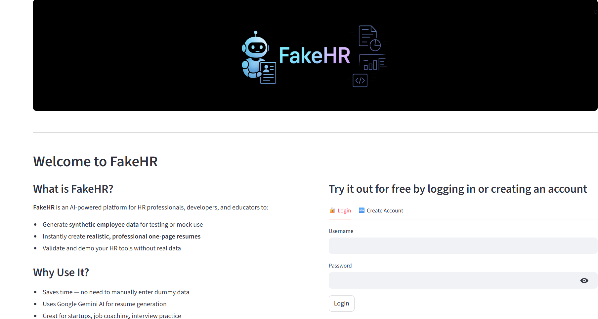
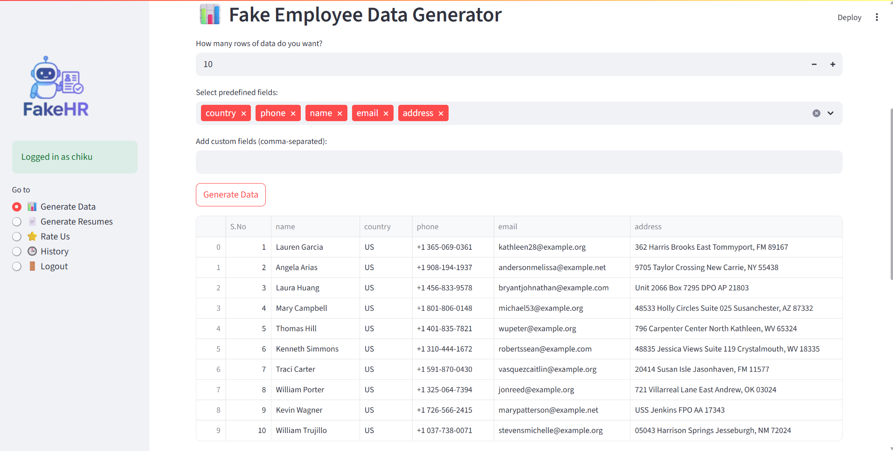
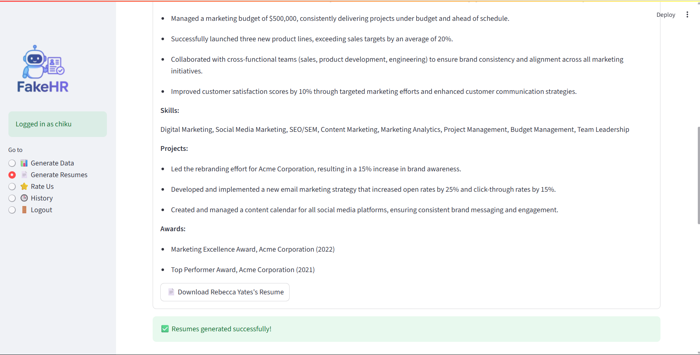
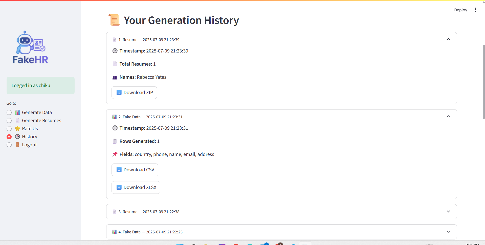
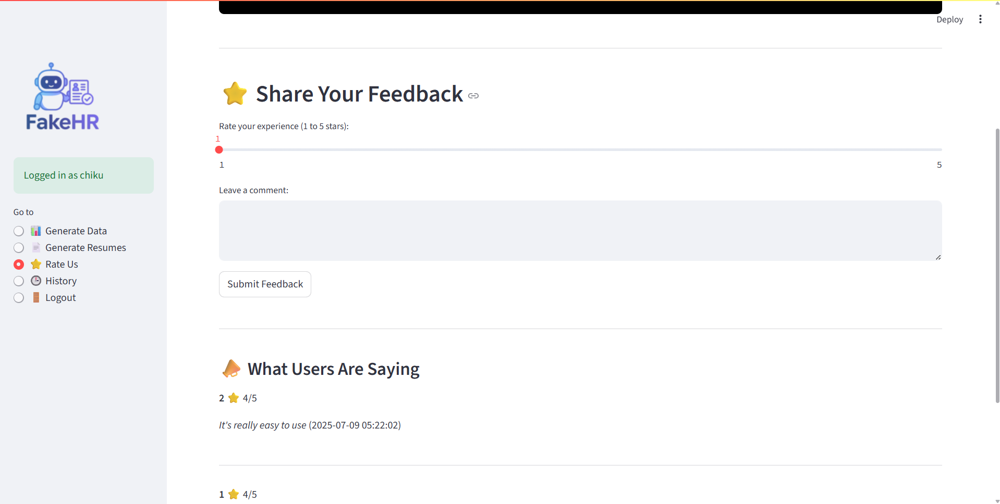

# 🤖 FakeHR – AI-Powered Synthetic Resume & Employee Data Generator

**FakeHR** is a one-stop AI-powered tool designed to generate **realistic fake employee data** and **professional one-page resumes**. It’s perfect for developers, HR tech startups, educators, or anyone who needs synthetic HR data for testing, training, or demos — all without compromising real user data.

---

## 🚀 Why FakeHR?

Creating dummy data and resumes for testing HR tools is often time-consuming and lacks realism. FakeHR solves that with:

✅ **AI-generated resumes** (Google Gemini)  
✅ **Realistic employee datasets** with names, emails, job roles, etc.  
✅ **Bulk generation** with CSV, JSON, Excel & ZIP resume download  
✅ **User history tracking**  
✅ **Feedback & Ratings** system  
✅ **Mobile-friendly interface (Streamlit)**

---

## 📸 Screenshots

  

🔐 Login & Signup

  

📊 Employee Data Generator

  

📄 Resume Preview

  

🕒 Generation History

  

⭐ Feedback Section

  

---

## 🧠 How It Works

1. **Sign up or log in**
2. **Generate fake employee data** by selecting predefined or custom fields
3. **Generate resumes** using AI (based on selected data)
4. **Preview & download** individual or bulk resumes (ZIP)
5. **Give feedback** and **track generation history**

---

## 💡 Use Cases

- HR software testing without real user data
- Job coaching and mock interview practice
- Demonstrating resume parsing or recruiting tools
- Generating mock data for data science or ML models

---

## 🛠️ Tech Stack

- [Streamlit](https://streamlit.io) – UI framework
- [Google Gemini API](https://ai.google.dev) – Resume generation
- [SQLite](https://sqlite.org) – Lightweight database
- [pandas](https://pandas.pydata.org/) – Data handling
- [wkhtmltopdf](https://wkhtmltopdf.org) – PDF generation from HTML
- [bcrypt](https://pypi.org/project/bcrypt/) – Secure password hashing

---

## 📦 Features

| Feature | Status |
|--------|--------|
| 🔒 Login / Signup with secure bcrypt auth | ✅ |
| 🏭 Synthetic employee data generator | ✅ |
| 📄 AI-based resume generation (Gemini) | ✅ |
| 💾 Export CSV / JSON / Excel / ZIP | ✅ |
| 🔁 History tracking per user | ✅ |
| 🌟 Feedback system | ✅ |
| 📱 Mobile-friendly responsive layout | ✅ |
| 🎨 Custom branding & logo | ✅ |

---

## 📂 Project Structure
      FakeHR/
      ├── .env.example                  # ✅ Sample env file (do NOT include real keys)
      ├── .gitignore                   # ✅ Ignores .env, output/, venv/, cache etc.
      ├── README.md                    # 📘 Project overview
      ├── requirements.txt             # 📦 Python dependencies
      ├── app.py                       # 🚀 Main Streamlit app
      ├── database.py                  # 💾 SQLite DB logic
      ├── demo.py                      # 🧪 Optional testing/demo file
      ├── employee_generator.py        # 🧍 Fake employee data logic
      ├── gemini_resume.py             # 🤖 Resume generation using Gemini
      ├── generate_pdf.py              # 📄 Convert resume HTML to PDF (WeasyPrint)
      ├── fakehr.db                    # ⚠️ (ignored in repo) Local DB file
      ├── users.db                     # ⚠️ (ignored in repo) Optional DB if separate
      
      ├── auth/
      │   └── hashing.py               # 🔐 Password hashing (bcrypt)
      
      ├── output/                      # ⚠️ Ignored - Stores generated files
      │   ├── resumes/
      │   ├── zips/
      │   └── generated/
      
      ├── static/
      │   ├── logo.png                 # 🖼️ App logo
      │   ├── banner.png               # 🏞️ Top banner
      │   └── screenshots/             # 📸 README images
      │       ├── login.png
      │       ├── data_generation.png
      │       ├── resume_preview.png
      │       ├── history.png
      │       └── feedback.png
      
      ├── templates/
      │   └── resume_template.html     # 🎨 HTML template for resumes
      
      └── .streamlit/
          └── config.toml              # 🌗 Theme & layout configs

📥 Setup Instructions

🔧 1. Install dependencies
        pip install -r requirements.txt

🔐 2. Set up API Key
    Rename .env.example to .env and add your Gemini API key:

    GEMINI_API_KEY=gemini_api_key here

▶️ 4. Run the app
streamlit run app.py

🤝 Contributing
Pull requests are welcome! For major changes, please open an issue first.

📃 License
MIT License

